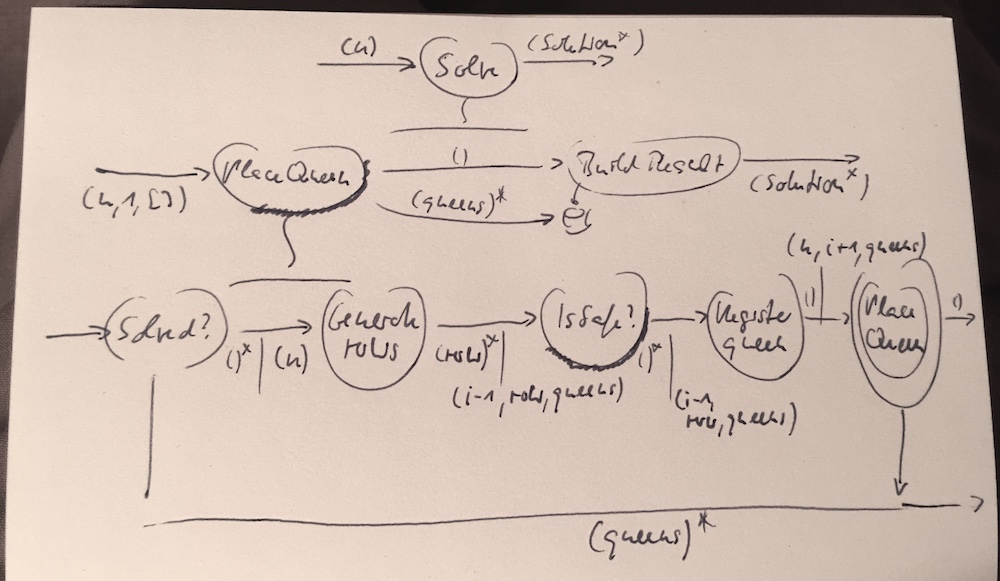

# The N-Queen Problem
Write a function to return all solutions to the n-queen problem for a given *n*:

From [Wikipedia](https://en.wikipedia.org/wiki/Eight_queens_puzzle):

> The [n] queens puzzle is the problem of placing [n] chess queens on an [n]×[n] chessboard so that no two queens threaten each other.

## Analysis
As it turns out, the n-queen problem only really is a problem for n>=4.

A visual list of all solutions for n=4..9 can be found [here](https://stamm-wilbrandt.de/en/xsl-list/n-queens/n-queens.xsl.xml).

* For n=1 there is no problem, because only a single queen can be placed and it never can threaten itself.
* For n=2 there is no problem, because after the first queen is placed all remaining squares are under threat. The remaining second queen cannot be placed.
* For n=3 the first queen puts almost all squares under threat, and the second queen covers the rest.

But from n=4 on things become different:


A queen on some _square_ of the _board_ threatens all squares in the same _column_:


And all squares in the same _row_:


And all squares in the _diagonals_ "radiating" from it:


The image first shows the *descending* and then the *ascending* diagonal.

A queen placed right in the middle of a 3x3 board thus threatens all remaining squares. But one placed on any other squares leaves room to place a second one:


After a queen has been placed on a square not under threat, the next queen of course can only be place on one of the remaining squares still not under threat.

There is no rule or restriction other than that on how to place queens. Just do it until either all n queens have been placed - or there are no more _safe_ squares (i.e. squares not threatened).

### Acceptance criteria
The solution will be accepted if the following function has been implemented:

```
Solution[] Solve(int n)
```

with

```
class Solution {
  public Position[] Queens;
  
  public class Position {
    public char Col; // 'a'..char(n) (e.g. 'd' for n=4)
    public int Row; // 1..n
  }
}
```

And the function returns the solutions for n=4 and n=6.

Also, if n<4 no solution will be returned.

## Solution design
### Finding simpler subproblems
I don't see a way to simplify the problem except for reducing n from the usual 8 to the minimal 4 for a start. But that does not help making the problem to (initially) solve smaller. Solving it for n=4 requires the same features as for n=6 or n=8 etc.

Of course it would be simpler if a queen would be less threatening, e.g. if she only threatened a row instead of row + column + diagonals. But a test relying on this simplification would not be valid anymore once the queens "power" is increased.

What's left is that n<4 is easier to solve then n>=4. But that's trivial.

### Finding complementary subproblems
The overall problem seems to consist of three major complementary subproblems:

* Repeatedly placing a queen on a safe square.
* Determining the squares still safe.
* Roll back a solution if it turns out a queen cannot be placed due to a lack of safe squares. Then one or more previous queens have to be repositioned to remove their threats from some squares.

#### Placing a queen
The position for the current queen could be chosen at random. But that would maybe make it harder to roll back, in any case it would lead to collisions with already placed queens. Better to progress from queen to queen in a more systematic way.

Queens could be placed column by column. The first queen somewhere in the first column (a1..an)m the second queen in the second column (b1..bn) etc.

Once queen i has been place in column i other squares will be under threat. Of course, then not all squares in column i+1 are safe anymore for queen i+1.

Within a column placement can be attempted from row 1 to row n.

#### Determining a square's safety
When a queen is placed all squares threatened by her could be marked as unsafe by registering the positions in some data structure. That could be a list of unsafe positions or a square board with tri-state squares (safe,unsafe,occupied).

Alternatively only the positions of placed queens could be recorded - and then to check if a candidate square is safe it's checked against the "threat vectors" of the queens present.

It seems that marking threatened squares would require the same effort as checking a candidate square for a threat - plus keeping a data structure around.

#### Rolling back a solution
If queens would be placed systematically column by column and row by row and only queen positions would be recorded, it would be easy to roll back a solution.

If queen i cannot be placed anywhere in its column i then queen i-1 has to be repositioned. That means it needs to move to the next row with a safe square in its column. From there placing queen i is tried again.

If no safe squares are left in column i-1 then the solution has to be rolled back to queen i-2 etc.

This is a backtracking problem to be best solved with recursion, I guess.

#### Integration
How could solutions for these subproblems be shaped so that I can easily assemble them into an overall solution?

I think the easiest part is checking for square safety:

`bool IsSafe(Position candidatePosition, Position[] queens)`

Then there is placing the next queen:

`void PlaceQueen(int n, int i, Position[] queens, Action<Solution> onSolutionFound)`

Placement needs to know which queen it's about (i.e. into which column it goes) and which queens have already been placed so it can be determined which squares in the column are safe.

But since the solution is recursive this is the method to call itself. It thus needs to know if there are any queens left to place.

Plus it needs to have a way to report a solution if one was found. I like to use a continuation for that instead of a data structure which accumulates results.

The hardest problem, it seems, is checking for square safety. All else is enumeration (columns, rows) and tracking of queen positions.

* Rows are enumerated in `PlaceQueen()`.
* Columns are enumerated by calling `PlaceQueen()` with the next queen's number.
* The queen positions passed to `PlaceQueen()` in the end are what goes into a `Solution{}`. Collecting all solutions is a trivial matter.

The wrapper for all this is `Solve()` which kicks-off queen placement and collects the solutions in a continuation.

Bottom-up development seems feasible:

1. `IsSafe()`
2. `PlaceQueen()`
3. `Solve()`

### Solving the safety check
Checking a square for safety to me seems at the core of the n-queen problem. I better get this one right.

Can this problem be simplified? Yes, I guess. Instead of solving it for any n x n board I can start with a 3x3 board. All "threat vectors" are present, but their length is fixed and minimal.


Checking a square for safety means checking for the presence of a queen along the "threat vectors" radiating out from that square. A square is not safe, if a queen which would be placed on it, would threaten another queen.


Checking for a threatening queen can be understood as "looking around" in different directions:

* Looking up/**north**: same column, rows above
* Looking down/**south**: same column, rows below
* Looking left/**west**: same row, columns to the left
* Looking right/**east**: same row, columns to the right
* Looking **north-west**: squares on the diagonal to the upper left (first part of descending diagonal)
* Looking **north-east**: squares on the diagonal to the upper right (second part of ascending diagonal)
* Looking **south-east**: squares on the diagonal to the lower right (second part of descending diagonal)
* Looking **south-west**: squares on the diagonal to the lower left (first part of the ascending diagonal)

Starting from the square in question each direction is characterized by a combination of deltas for column and row:

* n(0,-1)
* s(0,+1)
* w(-1,0)
* e(+1,0)
* nw(-1,-1)
* ne(+1,-1)
* se(+1,+1)
* sw(-1,+1)


Generation of square coordinates along all vectors then should be basically the same and driven by these deltas. It starts with the candidate position and radiates out from there in the directions defined by the deltas.

Coordinates are generated until either row or column become <0 or >=n.

From the simplified problem a complementary problem has been derived: coordinate generation.

`Position[] GeneratePositions(Position candidatePosition, int n, int deltaColumn, int deltaRow)`

And once all positions along the "threat vectors" of candidate position have been generated, they can be checked against the positions of already placed queens. Should a queen's position be one of the "threat vectors" then the square in question is not safe.

To check that, is a second complementary problem:

`bool CheckThatNoQueensAreThreatened(Position[] threatVectors, Position[] queens)`

The name of this function is important. It should state that it's checked that no queen is threatened along the "threat vectors"; that matched the purpose of the integrating `IsSafe()` function. Naming it instead along the lines of "check if any queen is threatened" would require to invert its result; that would insert logic into `IsSafe()`.

Internally I'm assuming squares to have numeric 0-based coordinates only, e.g. (2,1) for column "c" and row 2. There needs to be a second `Position{}` type for that. Internal positions will then be mapped to "public" positions during creation of the `Solution{}`.

### Visual solution design



The crucial operations in this flow-design are `GeneratePositions()` and `CheckThatNoQueensAreThreatened()`.

The integrations `IsSafe()` and `PlaceQueen()` should be put under scaffolding test, too, though. To check if my "theory" of all this working together really delivers the desired result, holds true.

#### Classes
The overall problem is solved by the class `NQueenProblem{}`. Also two data classes have been defined: `Solution{}` and `Position{}`.

Should there be more classes? Can any of the behaviour be offloaded to a data class representing the board? Or should there be a class for the growing (and shrinking) list of queens?

* A board knows about its squares. Row generation could be made a responsibilty of a `Board{}` class.
* Also generation of "vectors" could be assigned to the board.
* The list of queens could be made an immutable ADT `Queens{}` which can check if a queen has already been placed on a certain position, and add another queen thereby producing a new instance.


## Implementation
### Board{}
I'm going to start the implementation with the `Board{}` class. It needs to...

* generate the squares for a given column and n, and
* generate the squares on a certain vector starting from a given square

### Queens{}
With the board in place I move on to the `Queens{}` class. It needs to...

* be immutable,
* allow for adding a queen, and
* check if any of a number of squares is occupied by a queen

The implementation for the check function is simple, but the question is, how exactly should the question be phrased?

`Queens{}` of course is a data type specific to the n-queen problem. On the other hand it should be pretty general in its services so it can be used in different contexts within the solution. It sits at the base of the class hierarchy, below the operation stratum.

To give it an `Add()` function is fitting this position. But should the check be `IsAnyOfTheseSquaresOccupied()`? That would fit best the single current context where this function would be used. But it's also very specific. Rather, I think, the function should be `Unoccupied()` which returns all squares from a list which are still free.

### NQueenProblem{}
#### IsSafe()
The core subproblem of the n-queen problem is checking for a square being safe. The main building blocks for that have been implemented: the `Board{}` and `Queens{}`. Now it's time to integrate them.

This is simple, just a bit tedious for the eight thread vectors.

### PlaceQueens()
Placing queens in all rows of a column should be easy. With the functions already in place the rest is not much effort. It can even be tested agains a 3x3 board since no recursion is necessary.

### Solve()
Finally `Solve()` is the top level integration. The only challenge there is to map the `Queens{}` to the `Solution{}`.


