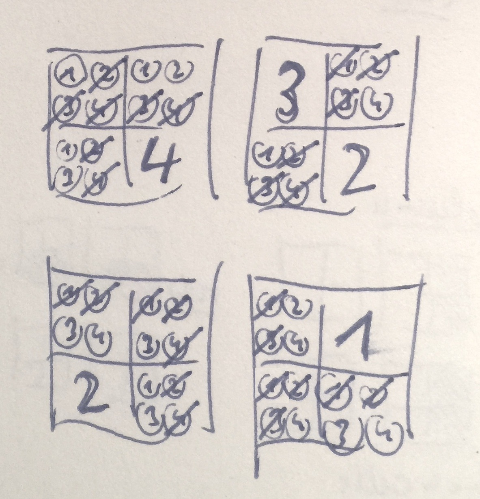

# Writing a Sudoku-Solver
#### Motivation
This is a challenge I wanted to take up since long. I read about Ron Jeffries not completing it with classical TDD (cTDD). So I'd like to give it a try and see how far I get without the urge or need to stick to cTDD or any specific method.

For that I explicitly do not look at Ron Jeffries' or anybody else's code. 

## Problem description
Sudoku is described [by Wikipedia](https://en.wikipedia.org/wiki/Sudoku) like this:

> The objective is to fill a 9×9 grid with digits so that each column, each row, and each of the nine 3×3 subgrids that compose the grid (also called "boxes", "blocks", or "regions") contains all of the digits from 1 to 9. The puzzle setter provides a partially completed grid, which for a well-posed puzzle has a single solution.

> Completed games are always a type of Latin square with an additional constraint on the contents of individual regions. For example, the same single integer may not appear twice in the same row, column, or any of the nine 3×3 subregions of the 9x9 playing board.

As an example this is the puzzle from Wikipedia:


And this is the solution from Wikipedia:


## Analysis
A Sudoku puzzle consist of a square *grid* of *boxes*, with each box again being a square grid of *cells*. The nested grids (grid of boxes, grid of cells) are of the same *size* n.

Typically n is 3, but I think any number >1 would be ok:

* a puzzle consists of n x n boxes
* a box consists of n x n cells
* a puzzle consists of n x n x n x n cells


...and each *column* and *row* of the puzzle would contain n x n cells:


Solving a puzzle means to put the numbers 1 .. n x n into all cells in a way so that they only appear once in each box, in each row, and each column:


In order to gain some experience playing Sudoku I played it online [here](https://sudoku.game) and [here](https://www.websudoku.com).

### The deliverable
The Sudoku solver can look quite simple. A single function will do:

`int[,] Solve(int[,] puzzle)`

The interface with the outside world needs to be just a square integer matrix with a width being the square of some (e.g. 4 (n=2), 9 (n=3), 16 (n=4)). Each array element represents a cell of the puzzle. Cells not set in the puzzle contain 0. All other cells contain a number in the range of 1 .. n x n.

A matrix with all cells set to a number in that range is returned as the solution. If none can be found an exception is thrown. Only square matrixes with a size > 1 can be processed; other matrixes cause an exception.

That seems to be the minimal surface for the solution. None of its internal workings or data structures should leak to the outside.

The function only returns a single result even if multiple results might exist. Picking the first result found during the solution process is fine.

### Acceptance criteria
The solution is accepted if it's able to solve the following puzzle with n=2


and this with n=3 taken from [here](http://elmo.sbs.arizona.edu/sandiway/sudoku/examples.html):


Checking the correctness of a solution can be done without sample data. All boxes, rows, and columns just have to be checked for completeness: have all numbers 1 .. n x n been assigned?

The encoding of the first puzzle should look like this:

```
var puzzle = new[,]{
  {0,0,3,0},
  {3,0,0,2},
  {0,1,0,0},
  {4,0,0,1}
}
```

### Increments
It's ok to focus on the sunny day: input data is correct. No validation is needed (at first). Validation is easy and would only defer tackling the real problem. The real challenge lies in solving the puzzle.

Without know a solution to the problem it seems that some puzzles might be simpler than others:

* a puzzle with n=2 is simpler than one with n=3, and
* a puzzle with n=2 and 15 out of 16 cells already set is easier than one with just 5 or even 14 cells set.

In the end, though, the difficulty of solving a Sudoku puzzle should not be higher with increasing n. The algorithm will very likely be the same for n=2 or n=10. It just will take more time/memory to solve an n=10 puzzle. Hence it's not necessary to encode larger puzzles as acceptance criteria.

## Design 1
There seem to be two basic approaches to solve the problem:

* brute force
* smart

### Brute force
A brute force approach would look like this:

Solve the puzzle for k remaining cells...

1. pick the first of the remaining cells,
2. for each number from 1 to n x n,
  1. check if the number would be ok in that cell (by checking the constraints on box, row, colum)
  2. if ok, assign the number to the cell, and
      1. solve the puzzle for k-1 remaining cells.
  3. if not ok or no solution was found go back up to step 2.
 
That would be a simple solution with the most difficult part being the constraint check. Also some though would have to go into data structures.

But would that approach be feasible?

For n=2 there would be 16 cells each with 4 numbers to check. That would lead to 4 x 4 x 4 x ... 4 = 4^16 = roughly 4.2 billion different boards to check. Or maybe not, because due to the already place numbers in a puzzle the remaining choices for each cell are maybe just 2 or 3 numbers (average 2.5). Also since some cells are already claimed not all 16 would need to be checked. Are more realistic brute force figure maybe would be 2.5^11 which is less than 25000 different boards. And not even all of them would be fully generated; due to constrains not all branches in the recursion tree would be followed.

For n=2 brute force seems to be a feasible approach.

For n=3, though, there would be 81 cells each with 9 numbers to check. Not all those numbers, though, are candidates due to other numbers already placed. So I'll assume it's just 5 numbers on average. Also not all 81 cells need to be checked. I'll assume 25 to be alredy occupied (as in hard or evil puzzles). That leaves 5^56 or some 1.3 x 10^39 possible boards. That's a lot!

Even if I assume that only one in a billion boards gets generated that still would be 10^30.

If each board only took a nanosecond to generate it would still take 10^21 seconds or many times longer than the universe exists.

Maybe I could shave of some more powers of 10, but in the end, I guess, it's too uncertain if a brute force approach would deliver a solution in a reasonable amount of time for n>2.

### Smart
What's a smart approach? I'd say it's one which tries to cut down a "solution tree" as fast as possible.

Here's what I mean:



This puzzles shows all cells either filled with a *given number*, e.g. 4 in the upper left box, or all *possible numbers* (1..n x n).

In each cell, however, the possible numbers already have been narrowed down to *candidate numbers*, e.g. 1 in the upper left cell or 3 and 4 in the lower right cell.

Candidate numbers are the numbers which might be the *solution number* for their cell.

Candidate numbers are arrived at by checking the constraints for box, row, column for all possible numbers. For the upper left cell that means, 2, 3, and 4 are no candidates they already can be found in the same box (4) or row (3) or column (2).

And with all but one possible numbers eliminated the remaining candidate number 1 even must be the solution number for the cell. The same is true for the candidate number 4 in the upper right cell.

But some cells still have more than one candidate number left making further inquiry necessary.

Such application of constraints is very quickly pruning the solution tree. No solutions with a 1 in the upper right cell or a 3 in the upper left cell of the lower right box need to be tried.

#### Smart algorithm v1
To get closer to a solution I watched myself a couple of times solving Sudoku puzzles.


As you can see, n=3 puzzles were no fun to do (top middle puzzle); I did not finish them by explicitly working with possible and candidate numbers. I pretty much stuck to n=2 puzzles to develop a solution.

And once patterns seemed to emerge I tried to formalize them. Here's my first take on how to solve the problem:

It all starts with a *workbench*. That's a matrix matching the puzzle size where each cell is filled with all possible numbers.


Then the given numbers from the puzzle are placed on the workbench. That naturally leads to cells with only a single candidate number, which means the puzzle has been partially solved for those cells already. The number of those cells is now *fixed* (circled numbers in below picture).


After setting up the workbench like this the fun begins!

The solution numbers resulting from placing the given numbers constrain the other cells (green marks). Not all possible numbers can remain candidate numbers.


Applying the constraints to all cells with multiple candidate numbers sometimes has no effect on the candidate numbers, sometimes only leads to a decrease in their number, but sometimes results in just one candidate number left (green circled numbers).


Since applying the constraints leads to new fixed cells the constrains have to be applied again (red marks and circles).


And then again:


After this last constrain-fix pass the puzzle has been solved. All cells have been fixed.

The algorithm so far:

1. Initialize
  1. Create workbench
  2. Place given numbers on workbench
2. Constrain non-fixed cells (strike through invalid candidate numbers)
3. Fix cells where only one candidate number is left (circle solution number)

Repeat steps 2 and 3 until all cells have been fixed.

#### Smart algorithm v2
Unfortunately this algorithm sometimes is hitting a wall. Here is another puzzle I attacked with the version 1 algorithm:


The first three constrain-fix passes are working (blue, green, red). But then the fourth pass (brown) is hittig a wall:


The red circled numbers cause only brown removals of candidate numbers. But constraining the candidates in that manner does not result in any cells which could be fixed. The pass does not lead to any new solution numbers. A next pass of constraining does not have any starting points.

What to do now?

This standstill has to be broken by selecting an arbitrary non-fixed cell and fix it. This puzzle is more difficult than the one before. It can only be solved with some trial-and-error approach.

Here's a trial:


The top-left cell is arbitrarily picked and arbitrarily fixed to 1 (blue). This is enough to run two new passes (pink and green) starting from this choice.

Unfortunately the green pass again hits a wall. It's constraints do not lead to any fixed cells.

On top of the first trial a second has to be started: The lower-left cell of the upper-right box is fixed to 1 (brown):


And starting from this two more passes lead to a solution. Yay!🏆

The algorithm has to be extended:

1. Initialize
  1. Create workbench
  2. Place given numbers on workbench
2. Constrain non-fixed cells (strike through invalid candidate numbers)
3. Fix cells where only one candidate number is left (circle solution number)
4. If fixes can be applied go back to 2. Otherwise, if no solution has been found:
  1. Pick a cell and fix it
  2. Start again at 2 (recursion).

#### Smart algorithm v3
So far puzzles could be solved by trying an arbitrary fix in the case of a stand-still. But what if this fix does not lead to a solution? Since the fix is arbitrary there's no guarantee to pick a candidate number which is the solution number.

The algorithm has to be prepared for the error in trial-and-error.

From what I can see errors have two forms:

* Applying the constrains leads to a cell with no candidates left.
* Fixing cells leads to two cells with the same solution number within a cell's *constraint horizon*.

Here's an example for the latter:


Arriving at such a conflict requires a harder puzzle. As you can see it took me some trials to finally get two cells to be fixed to 2 within their constraint horizon.

The constraint horizon of a cell encompasses its box, its row, and its column.

When a trial is hitting an error all changes have to be rolled back and another trial has to be run. In this case the trial was fixing a cell in the top-middle box to 3 (blue circle). This obviously does not lead to a solution. The next trial could be to fix the same cell to 8. And if that does not work out move on to the next cell and fix it to 6 and so on and so on.

The algorithm needs to be adapted to run several trials on error:

1. Initialize
  1. Create workbench
  2. Place given numbers on workbench
2. Constrain non-fixed cells (strike through invalid candidate numbers)
3. Fix cells where only one candidate number is left (circle solution number)
4. If fixes can be applied go back to 2. Otherwise, if no solution has been found:
  1. Pick a cell and fix it
      1. Start again at 2 (recursion).
      2. If no solution could be found, go back to 4.1.

#### Simpler test cases
As far as I can see, the Sudoku solver problem now is basically solved. It's based on a trial-and-error recursion which is not brute force. That feels right.

Interestingly on my journey towards the soltuion I uncovered several levels of difficulty of Sudoku puzzle. At the outset, without knowing anything about a solution were not visible - but now, with regard to a certain solution, they are.

1. Puzzles which require just constrain-fix passes.
2. Puzzles which require "manually" fixing cells.
3. Puzzles which require "manually" fixing in a trial-and-error manner.

Examples for each level have been shown. They can serve as additional test case during an incremental implementation.

#### Data structures
With the overall behavior creation, i.e. the algorithm sketched I can take a closer look at what role data structures play in it.

A simple `int[,]` matrix certainly is not enough. It's just the means to carry the problem into and the final solution out of the solver.

What has proven helpful is an additional grid where each cell is initialized with possible numbers which then are narrowed down to several candidate numbers and finally to just one solution number. I'll call that a *workbench*:


Its basic structure seems obvious:

```
class Workbench
{
    public class Cell
    {
        private List<int> _candidateNumbers;
    }

    
    private Cell[,] _cells;
}
```

But what functionality should it offer? I think, I don't know yet. I have to refine the algorithm first. At least its first increment.

#### Data flow
The first increment of the algorithm is straightforward:


Yes, that's straightforward for me, even though it's cryptic for everyone else. But that's mostly due to my handwriting. More importantly the visual notation is trivial, but very helpful to clarify my thinking: it shows the transformation of the puzzle into a solution as a nested data flow and at the same time assigns the steps to modules.

The workbench plays a key role in this. It's at the beginning and end of the process. First it inflates itself from the puzzle matrix, finally it serializes itself into a solution matrix. Since the workbench is a matrix like the puzzle is, I think it's ok to assign this mapping functionality to the workbench. If that later should prove detrimental to evolving the code I can easily extract these responsibilies.

```
class Workbench
{
    public class Cell {
        private List<int> _candidateNumbers;
    }
    
    private Cell[,] _cells;
    
    
    public Workbench(int[,] matrix) {}
    
    public int[,] Matrix { get; }
}
```

Solving the puzzle thus at the top level of abstraction works on an `int[,]` matrix, but in reality it works in a `Workbench`. This is why another `Solve` is sitting between two `Workbench` process steps.

```
public class SudokuSolver
{
    // high level
    public static int[,] Solve(int[,] puzzle) { ... }
    
    // lower leveler
    void Solve(Workbench workbench) {}
}
```

What else is needed from a workbench? The solver first wants to constrain cells and then fix them and then check if a solution has been found.

As it turns out, fixing is trivial: a workbench cell can be asked tell if it's fixed already, that means contains only a final candidate number. Hence fixing does not even need to be an explicit step in the process.

But the solver needs to be able to determine which cells have been fixed and if any unfixed are left. That again can be a responsibility of the workbench. It's easily done and a purely structural question.

The fixed cells are also of interest for the constraining process step. For each fixed cell it wants to remove its solution number from all cells in its horizon.

```
class Workbench
{
    public class Cell {
        private List<int> _candidateNumbers;
        
        public bool IsFixed { get; }
        public int SolutionNumber { get; }
        
        public void RemoveCandidate(int number) {}
    }

    private Cell[,] _cells;
    
    
    public Workbench(int[,] matrix) {}
    
    public Cell[] Fixed { get; }
    public Cell[] Unfixed { get; }
    
    public Cell[] Horizon(Cell center) { ... }
    
    public int[,] Matrix { get; }
}
```

This makes the Sudoku solver pretty simple. The flow shown above can be translated easily into functions and even integrations.

```
public class SudokuSolver
{
    public static int[,] Solve(int[,] puzzle) {
        var wb = new Workbench(puzzle);
        Solve(wb);
        return wb.Matrix;
    }

    static void Solve(Workbench workbench) {
        while (SolutionFound() is false)
            Constrain(workbench);

        bool SolutionFound() => workbench.Unfixed.Length == 0;
    }

    static void Constrain(Workbench workbench) {
        foreach (var fixedCell in workbench.Fixed)
            foreach (var horizonCell in workbench.Horizon(fixedCell))
                horizonCell.RemoveCandidate(fixedCell.SolutionNumber);
    }
}
```

Please note how the recursion in the data flow is replaced by a simple `while` loop. In a data flow there are not loops (data flowing back upstream); instead recursive steps are used. But when encoding a data flow that can be replaced with a loop, if it does not make testing or understanding harder.

Initially, I'd say, there is not even anything to test, except the root function. The incremental tests defined above will do the job just fine. I just have to be careful to only apply the level 1 test since a level 2 puzzle will let the solution go into an infinite loop.-

Now it's clear: the workhorse is the `Workbench` class. I need to build it function by function. No further design is needed, I guess.

## Implementation 1

impl for level 1 was straightforward

## Implementation 2
for level 2 some more functionality on Cell needed
level 2 initially the test was wrong; same for level 3. realized it because level 2 was unexpectedly green as soon as level 1 turned green.

for level 2 Solve(Workbench) go a bit more complicated. i used local functions to keep it clean on a hi level:

```
static void Solve(Workbench workbench) {
    var n_fixed_before_pass = workbench.Fixed.Length;
    
    while (SolutionFound() is false) {
        Constrain(workbench);
        Trial_required(() => {
            Fix_first_unfixed_cell();
            Solve(workbench);
        });
    }
    ...
}
```

## Implementation 3
some refactoring first making Solve() more straightfwd.

cloning workbench for recursive trials.


## Retrospective


Implementing acceptance tests required some programmimng for `SolutionChecker{}`. It was small problem of its own.

data structure in co-evolution with behavior.
first behavior then data structures. which functionality to assign to data structures.

wait for behavior because only the you know what functionality is really needed on a data structure. otherwise there is a tendency to over generalize (an optimization for an uncertain future).


